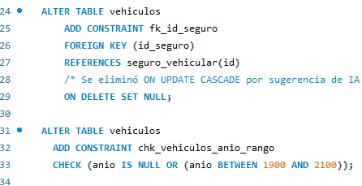
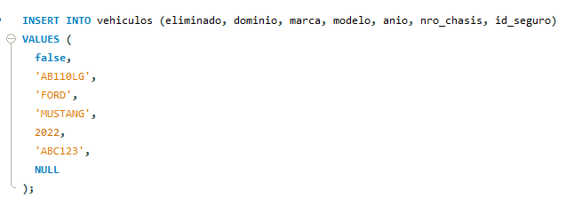

# Trabajo Final Integrador (TFI) - Bases de Datos I 

## Etapa 1 – Modelado y Definición de Constraints

### Creación base de datos y tablas

### Incorporación contraints

### Prueba la robustez
#### Inserción válida

#### Inserción errónea por anio fuera de rango
 
 