# Trabajo Final Integrador (TFI) - Bases de Datos I 

## Etapa 1 – Modelado y Definición de Constraints

### Creación base de datos y tablas


### Incorporación contraints


### Prueba la robustez
#### Inserción válida


#### Inserción errónea por anio fuera de rango


### Demostración DER 


## Etapa 2 - Generación y carga de datos masivos con SQL puro

### Creación de tablas semilla, se genera una tabla temporal con una secuencia de hasta 200.000 para generar esos registros


### Se insertan primero los seguros para integridad referencial


### Se insertan los vehiculos tomando como referencia los numeros creados en la tabla semilla


### Emparejamiento de los vehiculos con los seguros atravez de FK id_seguro


### Conteo de tuplas


### Sin registros huerfanos


### Sin seguro reutilizado, lo cual violaria la relación 1:1


### Conteo y proporciones


### Descripción conceptual 
Usé una tabla con números del 1 al 200.000 como base, y a partir de esos números generé todos los datos de forma automática usando operaciones matemáticas simples. Primero creé los seguros, después los vehículos, y al final los conecté.
 - Se usaron los siguientes comandos sql:
    - WITH RECURSIVE: Para generar la lista de números del 1 al 200.000
    - INSERT ... SELECT: Para insertar muchos registros de una sola vez
    - CASE WHEN: Para elegir diferentes valores según el número
    - MOD(): Para rotar entre opciones (resto de la división)
    - CONCAT(): Para armar textos únicos (como "POL-00000001")
    - UPDATE con JOIN: Para conectar vehículos con seguro
Primero inserté los seguros porque los vehículos tienen una foreign key (clave foránea) que apunta a los seguros. Si intentaba crear un vehículo con un seguro que no existe, MySQL me daba error.

## Etapa 3

### Consultas JOIN
> Permite obtener información de los vehículos, mostrando datos ténicos del mismo y del seguro, se utiliza un INNER JOIN para traer 
los vehículos que tengan un seguro registrado, se establece un filtro para que no traiga vehículos o seguros caducados, finalmente se ordenan por dominio.

SELECT 
    v.dominio,
    v.marca,
    v.modelo,
    v.anio,
    s.aseguradora,
    s.nro_poliza,
    s.cobertura,
    s.vencimiento
FROM vehiculos v
INNER JOIN seguro_vehicular s ON v.id_seguro = s.id
WHERE v.eliminado = FALSE 
  AND s.eliminado = FALSE
ORDER BY v.dominio;

> Detecta los vehículos cuyos seguros caducan en un plazo pre establecido de 30 días.
Podría servir para generar alertas preventivas o notificaciones de próxima caducación a los propietarios o asegurados, 
con esto se ayuda a mantener actualizadas las pólizas y asi poder evitar vehículos sin cobertura. Se filtra en base a la fecha acual y la sumatoria de la fecha actual + 30 días,
después se verifica que ni el vehículo ni el seguro estén eliminados y se ordenan por vencimiento de forma ascendente.

SELECT 
    v.dominio,
    v.marca,
    v.modelo,
    s.aseguradora,
    s.nro_poliza,
    s.vencimiento,
    DATEDIFF(s.vencimiento, CURDATE()) AS dias_para_vencer
FROM vehiculos v
INNER JOIN seguro_vehicular s ON v.id_seguro = s.id
WHERE s.vencimiento BETWEEN CURDATE() AND DATE_ADD(CURDATE(), INTERVAL 30 DAY)
  AND v.eliminado = FALSE
  AND s.eliminado = FALSE
ORDER BY s.vencimiento ASC;

### Consulta GROUP BY + HAVING
> Se analiza cómo se distribuyen los tipos de cobertura entre las principales marcas de vehículos.
Aporta una visión estadística útil para estrategias comerciales, análisis de riesgo o negociación con aseguradoras.

SELECT 
    v.marca,
    s.cobertura,
    COUNT(*) AS cantidad_vehiculos,
    ROUND(COUNT(*) * 100.0 / SUM(COUNT(*)) OVER (PARTITION BY v.marca), 2) AS porcentaje
FROM vehiculos v
INNER JOIN seguro_vehicular s ON v.id_seguro = s.id
WHERE v.eliminado = FALSE 
  AND s.eliminado = FALSE
GROUP BY v.marca, s.cobertura
HAVING COUNT(*) > 1000
ORDER BY v.marca, cantidad_vehiculos DESC;

#### 3 tiempos de ejecución de la consulta, mediana: 0,213 sec


#### EXPLAIN SIN INDICES


#### 3 tiempos de ejecución de consulta CON indices, mediana: 0.359 sec, hay más demora con indices


#### EXPLAIN CON INDICES


### Subconsulta
> Identifica vehículos más nuevos que el promedio anual de su marca.
Permite analizar qué modelos recientes destacan dentro del parque automotor de cada marca.
Puede usarse en estudios de renovación, tendencias o focalización de campañas de seguros.

SELECT 
    v.dominio,
    v.marca,
    v.modelo,
    v.anio,
    promedio.anio_promedio
FROM vehiculos v
INNER JOIN (
    SELECT 
        marca,
        AVG(anio) AS anio_promedio
    FROM vehiculos
    WHERE eliminado = FALSE
    GROUP BY marca
) promedio ON v.marca = promedio.marca
WHERE v.anio > promedio.anio_promedio
  AND v.eliminado = FALSE
ORDER BY v.marca, v.anio DESC;

### Script creación de vista
CREATE OR REPLACE VIEW vista_vehiculos_con_seguro AS
SELECT 
    v.id AS id_vehiculo,
    v.dominio,
    v.marca,
    v.modelo,
    v.anio,
    v.nro_chasis,
    s.id AS id_seguro,
    s.aseguradora,
    s.nro_poliza,
    s.cobertura,
    s.vencimiento,
    DATEDIFF(s.vencimiento, CURDATE()) AS dias_para_vencer
FROM vehiculos v
LEFT JOIN seguro_vehicular s ON v.id_seguro = s.id
WHERE v.eliminado = FALSE
  AND (s.eliminado = FALSE OR s.eliminado IS NULL);

#### Se creó una vista tipo reporte, sería la más usada por un usuario administrativo o empleado de aseguradora que necesita ver qué seguro tiene cada auto. Evita tener que hacer JOIN manuales en cada consulta. Sirve de base para generar reportes, por ejemplo: seguros próximos a vencer, vehículos sin seguro, vencimientos por aseguradora.


#### Interacción con IA para mejorar la consulta GROUP BY + HAVING
-- CONSULTA OPTIMIZADA POR IA
-- Indices para consulta optimizada por IA
-- Para vehiculos: filtra por eliminado y agrupa por marca
CREATE INDEX idx_vehiculos_eliminado_marca ON vehiculos(eliminado, marca);
-- Para seguro_vehicular: filtra por eliminado y agrupa por cobertura
CREATE INDEX idx_seguros_eliminado_cobertura ON seguro_vehicular(eliminado, cobertura);

-- Validación 1: FKs inválidas
SELECT 'FKs inválidas' AS validacion, COUNT(*) AS cantidad
FROM vehiculos v
WHERE v.id_seguro IS NOT NULL
  AND NOT EXISTS (SELECT 1 FROM seguro_vehicular s WHERE s.id = v.id_seguro);

-- Validación 2: Vehículos activos con seguros eliminados
SELECT 'Vehículos activos con seguros eliminados' AS validacion, COUNT(*) AS cantidad
FROM vehiculos v
INNER JOIN seguro_vehicular s ON v.id_seguro = s.id
WHERE v.eliminado = FALSE AND s.eliminado = TRUE;

-- PASO 1: Consulta principal con CTEs (más legible)
-- -------------------------------------------------------------------------

WITH vehiculos_activos AS (
    SELECT v.id, v.marca, v.id_seguro
    FROM vehiculos v
    WHERE v.eliminado = FALSE
      AND v.id_seguro IS NOT NULL
),
seguros_activos AS (
    SELECT s.id, s.cobertura
    FROM seguro_vehicular s
    WHERE s.eliminado = FALSE
),
conteo_por_marca_cobertura AS (
    SELECT 
        v.marca,
        s.cobertura,
        COUNT(*) AS cantidad_vehiculos
    FROM vehiculos_activos v
    INNER JOIN seguros_activos s ON v.id_seguro = s.id
    GROUP BY v.marca, s.cobertura
),
resultado_con_porcentajes AS (
    SELECT 
        marca,
        cobertura,
        cantidad_vehiculos,
        ROUND(cantidad_vehiculos * 100.0 / SUM(cantidad_vehiculos) OVER (PARTITION BY marca), 2) AS porcentaje
    FROM conteo_por_marca_cobertura
)
SELECT *
FROM resultado_con_porcentajes
WHERE cantidad_vehiculos > 1000
ORDER BY marca, cantidad_vehiculos DESC;

#### EXPLAIN DE ESTA CONSULTA


-- PASO 2: Validación de resultados (verificar que porcentajes suman 100%)
-- -------------------------------------------------------------------------

WITH vehiculos_activos AS (
    SELECT v.id, v.marca, v.id_seguro
    FROM vehiculos v
    WHERE v.eliminado = FALSE AND v.id_seguro IS NOT NULL
),
seguros_activos AS (
    SELECT s.id, s.cobertura
    FROM seguro_vehicular s
    WHERE s.eliminado = FALSE
),
conteo_por_marca_cobertura AS (
    SELECT 
        v.marca,
        s.cobertura,
        COUNT(*) AS cantidad_vehiculos
    FROM vehiculos_activos v
    INNER JOIN seguros_activos s ON v.id_seguro = s.id
    GROUP BY v.marca, s.cobertura
),
resultado_con_porcentajes AS (
    SELECT 
        marca,
        cobertura,
        cantidad_vehiculos,
        ROUND(cantidad_vehiculos * 100.0 / SUM(cantidad_vehiculos) OVER (PARTITION BY marca), 2) AS porcentaje
    FROM conteo_por_marca_cobertura
)
SELECT 
    marca,
    SUM(porcentaje) AS suma_porcentajes,
    CASE 
        WHEN ABS(SUM(porcentaje) - 100) < 0.1 THEN '✅ Correcto'
        ELSE '⚠️ Error de redondeo'
    END AS validacion
FROM resultado_con_porcentajes
GROUP BY marca;

#### EXPLAIN CONSULTA


## Etapa 4

### Creación de usuario y acceso a vistas
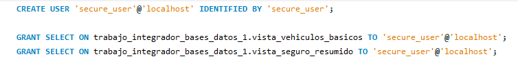

### Usuario creado SIN acceso a vista con datos sensibles
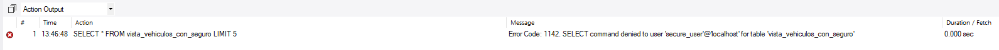

### Usuario creado CON acceso a vistas sin datos sensibles
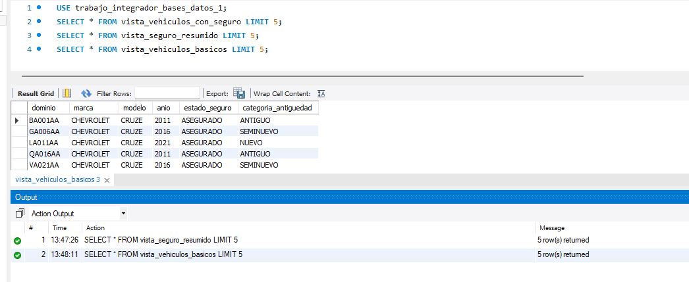

### Creación de vistas seguras
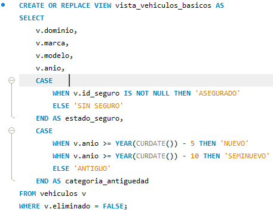
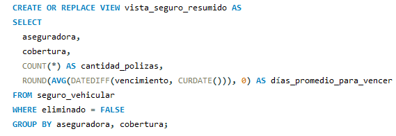

### Prueba de integridad por PRIMARY KEY
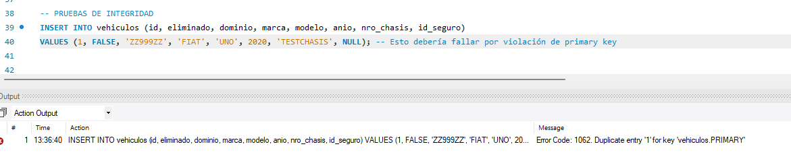

### Prueba de integridad por valor fuera de rango
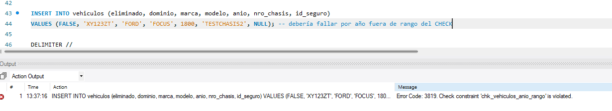

### Para la prueba anti inyección se creó el siguiente PROCEDURE
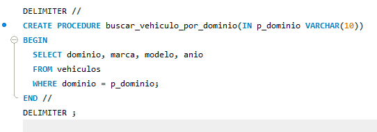
> El procedimiento buscar_vehiculo_por_dominio recibe un parámetro p_dominio de tipo VARCHAR(10) y lo utiliza directamente en la cláusula WHERE sin concatenación. Esto previene inyección SQL porque el valor se trata como un dato literal, no como código ejecutable. En la prueba maliciosa "AB110LG' OR '1'='1", MySQL rechaza la entrada por exceder los 10 caracteres permitidos (Error 1406) como se puede ver en la sección Prueba contra insesión maliciosa, bloqueando el ataque antes de ejecutar la consulta. Incluso si la entrada cupiera en 10 caracteres, el procedimiento buscaría literalmente ese texto como dominio, sin ejecutar la condición inyectada.

### Prueba de insersión legitima
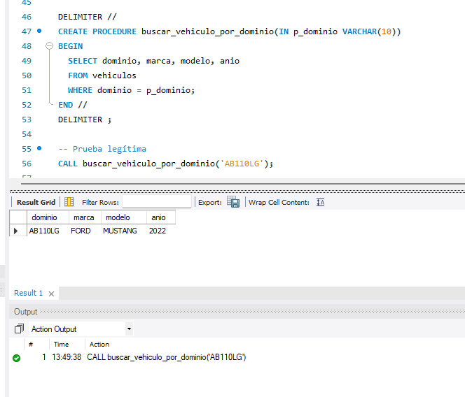

### Prueba contra insersión maliciosa
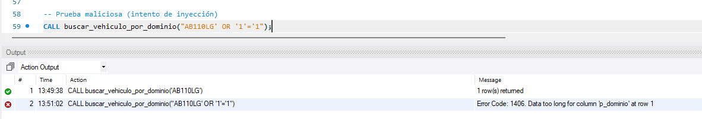

### Se mejoró el stored procedure con IA
``` CREATE TABLE IF NOT EXISTS auditoria_busquedas (
  id INT PRIMARY KEY AUTO_INCREMENT,
  usuario VARCHAR(100),
  dominio_buscado VARCHAR(10),
  fecha_hora TIMESTAMP DEFAULT CURRENT_TIMESTAMP,
  ip_origen VARCHAR(45),
  resultado_encontrado BOOLEAN,
  INDEX idx_usuario_fecha (usuario, fecha_hora)
);

-- Vista con datos públicos
CREATE OR REPLACE VIEW vehiculos_publicos AS
SELECT dominio, marca, modelo, anio
FROM vehiculos
WHERE eliminado = FALSE;

DELIMITER //
CREATE PROCEDURE buscar_vehiculo_seguro(
  IN p_dominio VARCHAR(10), 
  IN p_usuario VARCHAR(100), 
  IN p_ip VARCHAR(45)
)
BEGIN
  DECLARE v_consultas_recientes INT;
  DECLARE v_encontrado BOOLEAN DEFAULT FALSE;
  DECLARE v_count INT DEFAULT 0;
  
  -- VALIDACIÓN 1: Entrada no vacía
  IF p_dominio IS NULL OR TRIM(p_dominio) = '' THEN
    SIGNAL SQLSTATE '45000' 
    SET MESSAGE_TEXT = 'Error: El dominio no puede estar vacío';
  END IF;
  
  -- VALIDACIÓN 2: Caracteres sospechosos
  IF p_dominio REGEXP '[";\\-\\-]' THEN
    SIGNAL SQLSTATE '45000' 
    SET MESSAGE_TEXT = 'Error: El dominio contiene caracteres no permitidos';
  END IF;
  
  -- VALIDACIÓN 3: Formato esperado
  IF p_dominio NOT REGEXP '^[A-Z0-9]{5,10}$' THEN
    SIGNAL SQLSTATE '45000' 
    SET MESSAGE_TEXT = 'Error: Formato de dominio inválido';
  END IF;
  
  -- VALIDACIÓN 4: Rate limiting
  SELECT COUNT(*) INTO v_consultas_recientes 
  FROM auditoria_busquedas 
  WHERE usuario = p_usuario 
    AND fecha_hora >= DATE_SUB(NOW(), INTERVAL 1 MINUTE);
    
  IF v_consultas_recientes >= 10 THEN
    SIGNAL SQLSTATE '45000' 
    SET MESSAGE_TEXT = 'Error: Límite de consultas excedido (máx 10/min)';
  END IF;
  
  -- CONSULTA SEGURA
  SELECT * FROM vehiculos_publicos WHERE dominio = p_dominio;
  
  -- Verificar si se encontró resultado (reemplazando FOUND_ROWS())
  SELECT COUNT(*) INTO v_count 
  FROM vehiculos_publicos 
  WHERE dominio = p_dominio;
  
  IF v_count > 0 THEN
    SET v_encontrado = TRUE;
  END IF;
  
  -- AUDITORÍA
  INSERT INTO auditoria_busquedas (usuario, dominio_buscado, ip_origen, resultado_encontrado)
  VALUES (p_usuario, p_dominio, p_ip, v_encontrado);
END //
DELIMITER ;

-- Prueba legítima
CALL buscar_vehiculo_seguro('AB110LG', 'juan.perez', '192.168.1.100');

-- Prueba con inyección (rechazada por validación de caracteres)
CALL buscar_vehiculo_seguro("AB110LG' OR '1'='1", 'atacante', '10.0.0.1');
```

### Prueba válida 
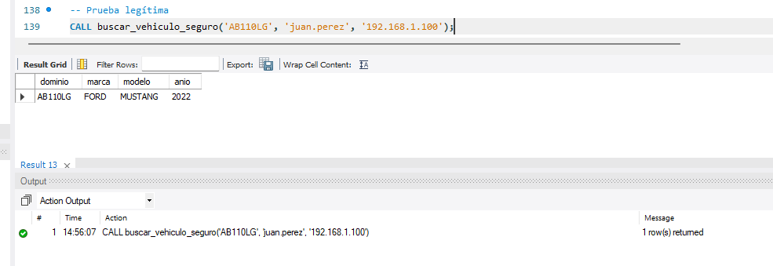

### Prueba válida pero se excede el límite de consultas
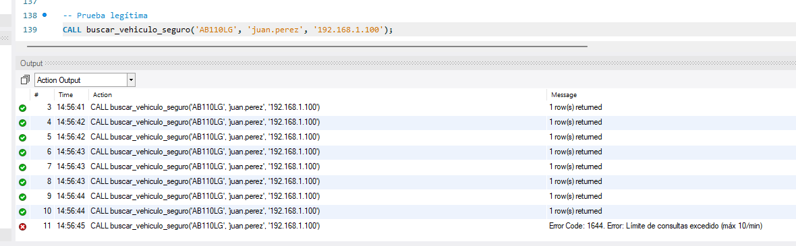

### Prueba de inyección 
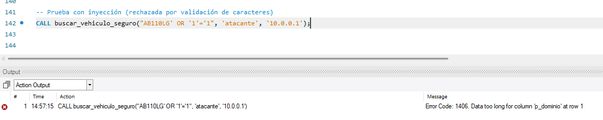

## Etapa 5
